# Diseño del pipeline semanal de desempeño de Nexova

Versión: 1.0.0
Fecha: 12/08/2026
Estado: listo para revisión técnica; sin implementación

## 1. Propósito

El pipeline existe para producir el **Reporte Semanal de Desempeño por Oficina
y Programa** que Laura (CEO) y Elena (L&D) consultarán cada lunes. Resuelve un
problema concreto: los eventos de inventario están optimizados para registrar
hechos individuales, pero dirección necesita cuatro números comparables entre
Valencia y Miami sin leer telemetría cruda ni pedir un PDF manual.

### Salida de negocio

Una fila por `office` + `programme_id` + semana ISO, donde `week_start` es el
lunes UTC:

| Columna | Regla de cálculo | KPI |
| --- | --- | --- |
| `total_material_cost` | `SUM(quantity * unit_cost)` de `inbound_order_created` | Inversión semanal de material |
| `kits_delivered_count` | `COUNT(*)` de `outbound_order_created` | Entregas registradas |
| `shortage_events_count` | `COUNT(*)` de `stock_threshold_triggered` | Frecuencia de escasez |
| `cost_variance_events_count` | `COUNT(*)` de `kit_cost_variance_detected` | Frecuencia de variación anómala |
| `currency` | EUR para Valencia, USD para Miami | Unidad monetaria local, sin conversión |

La definición v1 de `kits_delivered_count` sigue literalmente el contexto:
cuenta eventos de salida confirmados, no suma `quantity`. Antes de implementar,
se debe confirmar si el dominio garantiza una entrega por evento; si no, el KPI
de negocio debería renombrarse a `outbound_orders_count` o cambiarse, con
aprobación, a `SUM(quantity)`.

### Salidas técnicas

- Tabla `reporting.weekly_office_program_performance` con el esquema exacto de
  la sección 8.
- `GET /reporting/weekly-office-program-performance?week_start=YYYY-MM-DD`.
- `GET /reporting/pipeline-runs/latest` para estado y trazabilidad.
- `POST /reporting/pipeline-runs` para backfill/corrida manual autorizada.
- Registro auditable de cada ejecución y cuarentena de filas inválidas.

Quedan fuera de alcance otros eventos del catálogo de telemetría, predicciones,
conversión de moneda, dashboards frontend, cambios en
`services/telemetry/analysis.py` y `GET /telemetry/report`.

## 2. Preguntas para Laura, Elena y el equipo de origen

Estas respuestas deben quedar como decisiones en el ticket de implementación:

1. ¿Un `outbound_order_created` representa siempre un kit/certificado o puede
   incluir `quantity > 1`? Define si el KPI cuenta órdenes o unidades.
2. ¿A qué hora del lunes debe estar certificado el reporte y cuál es el máximo
   retraso esperado de eventos de Miami?
3. ¿Se pueden corregir eventos ya emitidos? Si se reemiten con el mismo
   `eventId`, ¿existe `ingested_at` o una versión para elegir el estado vigente?
4. ¿Qué ocurre si `programme_id` cambia o se fusiona? ¿Necesitamos una dimensión
   histórica con vigencia para no reescribir semanas previas?
5. ¿`unit_cost` excluye impuestos, portes y descuentos, y con cuántos decimales
   se conserva?
6. ¿El reporte del lunes es provisional y se reconcilia por eventos tardíos, o
   queda cerrado hasta un backfill aprobado?
7. ¿Quién puede disparar `POST /reporting/pipeline-runs` y qué semanas máximas
   puede recalcular en una sola solicitud?
8. ¿Cuánto tiempo deben conservarse raw/staging, cuarentena, logs y snapshots
   semanales por auditoría financiera?
9. ¿Cuál es el umbral aceptable de cuarentena antes de bloquear la publicación?
10. ¿Debe el endpoint devolver programas sin actividad con ceros? Eso exige una
    dimensión de programas activa por oficina; con sólo eventos no se pueden
    fabricar combinaciones sin actividad.

## 3. Fuentes y contratos

La única fuente v1 es `telemetry_events`, en modo sólo lectura, y sólo se
consideran cuatro eventos obligatorios:

| Evento | Campos usados | Destino |
| --- | --- | --- |
| `inbound_order_created` | envelope, `office`, `programme_id`, `quantity`, `unit_cost`, `currency` | Coste de material |
| `outbound_order_created` | envelope, `office`, `programme_id`, `currency` | Conteo de entregas |
| `stock_threshold_triggered` | envelope, `office`, `programme_id`, `currency` | Conteo de escasez |
| `kit_cost_variance_detected` | envelope, `office`, `programme_id`, `currency` | Conteo de variaciones |

El contrato fuente es `docs/telemetry/event-schemas.json` 1.0.0. Ya incluye
`quantity` y `unit_cost` en la entrada. `eventId` es la clave de deduplicación,
`timestamp` asigna la semana de negocio y `requestId` correlaciona con logs.
`ingested_at` pertenece a la tabla de almacenamiento y se usa sólo para
watermarks/orden de llegada, nunca para cambiar la semana del hecho.

### Ventana temporal

- Corrida programada: lunes 06:00 UTC para `[lunes anterior 00:00 UTC, lunes
  actual 00:00 UTC)`.
- `week_start = date_trunc('week', timestamp AT TIME ZONE 'UTC')::date`.
- La extracción usa una ventana de solapamiento de 48 h respecto al watermark
  para capturar retrasos/reintentos; deduplicación e upsert impiden dobles.
- Una reconciliación diaria recalcula las dos semanas ISO abiertas más
  recientes. Semanas anteriores requieren backfill manual con motivo.

## 4. Análisis de formatos

### CSV

CSV funciona bien como exportación humana o intercambio pequeño: es universal,
se comprime bien y se inspecciona sin tooling especializado. No es el formato
canónico adecuado para este pipeline porque no conserva tipos, enums, zona
horaria ni objetos `properties`; comas/encoding y columnas nuevas pueden romper
parsers silenciosamente. Tampoco aporta estadísticas de columna ni lectura
selectiva para backfills grandes.

Si un sistema legado sólo puede entregar CSV, se acepta en una zona de landing
inmutable junto con checksum, nombre, tamaño y fecha; se valida contra una
versión de contrato y se convierte antes de transformar. Nunca se agrega
directamente desde el CSV.

### JSON/JSONB en origen

El envelope de telemetría es JSON y `properties` varía por `event_type`, por lo
que JSONB en `telemetry_events` preserva el contrato y facilita ingesta. Su coste
es mayor tamaño y menor eficiencia analítica si cada reporte vuelve a extraer
campos desde JSON.

### Parquet en raw histórico

Se recomienda Parquet comprimido, particionado por `event_date` y
`event_type`, para snapshots/raw de largo plazo y backfills: mantiene tipos,
permite column pruning y reduce I/O. La contrapartida es que no es amigable para
edición manual ni cargas fila a fila; por eso no sustituye PostgreSQL como
fuente operativa ni tabla de serving.

### PostgreSQL en serving

La tabla `reporting` relacional es la salida apropiada: cuatro agregados, clave
única explícita, upsert transaccional y consultas sencillas para FastAPI. La
recomendación es, por tanto, **JSONB/tabla operativa → staging tipado → Parquet
raw opcional → PostgreSQL reporting**, no una conversión indiscriminada a un
solo formato.

## 5. Diagrama de flujo

```mermaid
flowchart LR
    sourceDb[(telemetry_events read only)]
    extractor[Extract by event time and overlap watermark]
    rawStore[(Immutable raw snapshot partitioned by run)]
    validator[Validate schema version types office and currency]
    quarantine[(Quarantine with safe reason codes)]
    staging[(Run scoped staging table)]
    deduplicator[Deduplicate by eventId and latest ingested_at]
    aggregator[Aggregate by office programme and ISO week]
    qualityGate{Quality gates pass}
    reporting[(reporting weekly office programme performance)]
    runLog[(reporting pipeline runs)]
    api[Reporting API]
    leaders[Laura and Elena]

    sourceDb -->|Four event types| extractor
    extractor -->|Snapshot plus checksum| rawStore
    rawStore --> validator
    validator -->|Valid rows| staging
    validator -->|Invalid rows| quarantine
    staging --> deduplicator
    deduplicator --> aggregator
    aggregator --> qualityGate
    qualityGate -->|Yes transactional upsert| reporting
    qualityGate -->|No fail run| runLog
    reporting --> api
    runLog --> api
    api --> leaders
    extractor -->|Start and counts| runLog
    qualityGate -->|Success and metrics| runLog
```



La cuarentena y el log no reinyectan datos automáticamente. Corregir y
reprocesar requiere una nueva corrida con un `run_id` diferente, conservando la
relación con la ejecución original.

## 6. Extracción, validación y transformación

### Extracción

1. Crear `run_id` UUID y fijar `window_start`, `window_end` y versión del job.
2. Leer con aislamiento consistente sólo las cuatro clases, por `timestamp` en
   la ventana lógica más el solapamiento y `ingested_at` hasta el corte de la
   corrida. Paginar por `(ingested_at, eventId)`, no por OFFSET.
3. Persistir manifest/checksum del snapshot raw. El mismo snapshot permite
   repetir la transformación sin que nuevas llegadas cambien el universo.
4. No actualizar ni marcar filas en `telemetry_events`.

### Validaciones antes de agregar

- Envelope 1.x compatible; `eventId` UUID, timestamps válidos y evento en la
  allowlist de cuatro.
- `office ∈ {valencia, miami}` y moneda exacta Valencia→EUR, Miami→USD.
- `programme_id` no vacío y normalizado; no se acepta `unknown`.
- En entradas, `quantity` entero >0 y `unit_cost` numérico ≥0.
- Para cada `office + programme_id + week_start` existe una sola moneda.
- Ningún valor no finito; decimales se calculan con `numeric`, nunca float.
- Los fallos van a cuarentena con `run_id`, `eventId`, `reason_code` y hash del
  payload. No se copia PII ni un mensaje de excepción.

### Transformación y agregación

Después de deduplicar, se proyectan sólo las columnas necesarias. Se crea el
universo de claves como la unión de `office + programme_id + week_start` de los
cuatro eventos y se agregan por filtro para no perder combinaciones que sólo
tienen escasez o variación:

- coste: suma decimal `quantity * unit_cost` para entradas;
- kits: conteo de eventos de salida, según contrato v1;
- escasez: conteo de eventos de umbral;
- variación: conteo de eventos de coste anómalo;
- moneda: valor único validado por oficina.

Los agregados vacíos dentro de una fila se rellenan con cero. No se crean filas
para programas sin evento, porque la fuente no define el universo completo.

## 7. Estrategia de deduplicación

La telemetría es append-only, pero entrega at-least-once, reintentos y backfills
pueden repetir un hecho. Se separan tres niveles:

1. **Duplicado exacto**: mismo `eventId` y mismo hash de payload. Conservar una
   fila; registrar `duplicates_exact_count`.
2. **Reemisión/corrección**: mismo `eventId`, payload diferente. Si el contrato
   de origen confirma correcciones, conservar mayor `ingested_at` (y desempatar
   por un `source_sequence` que debe añadirse); registrar conflicto. Sin ese
   contrato, bloquear la corrida: elegir silenciosamente podría reescribir un
   coste financiero.
3. **Duplicado semántico con IDs distintos**: no se colapsa por heurística de
   hora/producto/cantidad. Dos entregas iguales pueden ser legítimas. Se mide y
   se remite a calidad de origen.

La tabla staging impone `unique(run_id, event_id)` después de resolver el punto
2. La tabla final no almacena eventos y confía en el constraint
`unique(office, programme_id, week_start)` para una sola versión del agregado.

## 8. Carga e idempotencia

Tabla de destino obligatoria:

```sql
create table reporting.weekly_office_program_performance (
  id uuid primary key default gen_random_uuid(),
  office text not null,
  programme_id text not null,
  week_start date not null,
  total_material_cost numeric not null default 0,
  kits_delivered_count integer not null default 0,
  shortage_events_count integer not null default 0,
  cost_variance_events_count integer not null default 0,
  currency text not null,
  computed_at timestamptz not null default now(),
  unique (office, programme_id, week_start)
);
```

El algoritmo es **recalcular y sustituir el agregado completo de cada clave**,
no incrementar contadores existentes:

1. Transformar en staging aislado por `run_id`.
2. Ejecutar quality gates y calcular checksum/conteos esperados.
3. Abrir una transacción.
4. Hacer `INSERT ... ON CONFLICT (office, programme_id, week_start) DO UPDATE`
   asignando todos los KPI, `currency` y `computed_at` desde staging.
5. Marcar la corrida `succeeded` y avanzar el watermark en la misma transacción.
6. Commit; sólo después se publica la nueva versión al endpoint/cache.

Si falla antes del commit, PostgreSQL revierte tabla, estado y watermark. La
siguiente ejecución reutiliza el snapshot o extrae de nuevo el solapamiento,
deduplica y produce los mismos valores. Si el proceso muere después del commit
pero antes de responder, el reintento vuelve a asignar el mismo agregado; no lo
suma. `id` se conserva en conflicto para que consumidores no vean identidades
nuevas en cada corrida.

Un lock asesor por `week_start` impide dos cargas simultáneas de la misma
semana. Corridas de semanas diferentes pueden ejecutarse en paralelo. El
endpoint manual requiere una `idempotency_key`: repetir la solicitud devuelve
el `run_id` existente.

## 9. Tabla y API de ejecuciones

Cada corrida escribe como mínimo:

| Campo | Razón de auditoría |
| --- | --- |
| `run_id` UUID | Identidad estable de la ejecución. |
| `idempotency_key` | Une reintentos manuales al mismo run. |
| `pipeline_name`, `pipeline_version`, `schema_version` | Reproduce código y contrato aplicados. |
| `trigger_type`, `triggered_by` | Distingue scheduler/manual/backfill; actor opaco. |
| `window_start`, `window_end`, `watermark_before`, `watermark_after` | Explica exactamente qué datos se intentaron procesar. |
| `started_at`, `finished_at`, `duration_ms` | SLA y diagnóstico de lentitud. |
| `status` | `running`, `succeeded`, `failed`, `cancelled`. |
| `rows_extracted` | Reconcilia con la fuente. |
| `rows_valid`, `rows_quarantined` | Mide calidad antes de deduplicar. |
| `duplicates_exact_count`, `conflicts_count` | Audita la resolución de duplicados. |
| `rows_staged`, `rows_inserted`, `rows_updated` | Reconcilia transformación y carga. |
| `source_checksum`, `aggregate_checksum` | Detecta cambios no explicados entre reruns. |
| `error_code`, `failed_stage` | Diagnóstico seguro y accionable; sin stack/PII. |
| `parent_run_id`, `reason` | Traza backfill/reintento hasta su origen. |

`GET /reporting/pipeline-runs/latest` devuelve metadatos seguros y contadores,
nunca el error interno ni payloads en cuarentena. `POST /reporting/pipeline-runs`
valida semana ISO, autorización, rango máximo e idempotency key; responde 202
con `run_id`, no mantiene una petición HTTP abierta durante el ETL.

## 10. Quality gates y reconciliación

La carga se bloquea si ocurre cualquiera de estos casos:

- esquema incompatible o falta un campo obligatorio;
- moneda/sede inválida o más de una moneda por grano;
- coste negativo, quantity no válida o programa vacío;
- conflictos de payload para un mismo eventId sin regla de versionado;
- cuarentena >1% o superior al umbral acordado;
- `rows_valid != rows_staged + duplicates_exact_count` tras explicar conflictos;
- algún contador agregado es negativo o el coste pierde precisión decimal;
- la suma de eventos por tipo no reconcilia con los cuatro agregados.

En éxito se comparan el resultado y checksum con la ejecución previa de la
misma semana. Un cambio por evento tardío se publica y queda registrado; un
cambio sin variación del snapshot dispara investigación.

## 11. Robustez de producción

1. **Idempotencia verificable**: upsert de sustitución, snapshot, watermark
   transaccional e idempotency key; rerun produce el mismo checksum.
2. **Recuperación atómica**: staging por run y una sola transacción de carga;
   no existe un reporte parcialmente actualizado.
3. **Calidad que bloquea**: contratos, invariantes de moneda, reconciliaciones y
   cuarentena con umbral, no sólo `try/catch`.
4. **Observabilidad**: log estructurado, métricas de volumen/duración/retraso,
   alertas por fallo/SLA y correlación por `run_id`/`requestId`.
5. **Datos tardíos y backfill**: ventana solapada, reconciliación de dos semanas
   y backfill acotado/auditable sin editar fuente.
6. **Escalabilidad**: lectura por cursor, proyección temprana, particiones raw y
   agregación set-based; nunca se carga toda la historia en memoria.
7. **Seguridad**: cuenta read-only en telemetría, write sólo en `reporting`,
   secretos por entorno, RBAC del trigger y logs sin payload/PII.
8. **Evolución controlada**: versiones de job/schema, compatibilidad explícita
   y reproducibilidad de una semana con su snapshot original.
9. **Pruebas antes de release**: fixtures Valencia/EUR y Miami/USD, duplicados,
   evento tardío, conflicto, moneda incorrecta, caída a mitad del upsert y dos
   corridas concurrentes.

## 12. Operación, SLA y alertas

- Scheduler semanal a las 06:00 UTC; objetivo de publicación 07:00 UTC y alerta
  si no hay corrida exitosa a las 07:15.
- Alertar inmediatamente en fallo, incompatibilidad de schema, conflicto de
  evento o lock retenido; warning si cuarentena >0.1%, duración >30 min o
  retraso de fuente >24 h.
- Runbook: comprobar fuente/corte → schema/rechazos → dedupe → quality gate →
  transacción; sólo después reintentar con la misma idempotency key.
- No corregir manualmente la tabla reporting. Una corrección siempre entra por
  evento fuente válido o backfill versionado.
- Retención propuesta: snapshots raw 90 días, staging exitoso 14 días,
  cuarentena 90 días, logs de runs 13 meses y tabla semanal según política de
  reporting. Confirmar con Legal/Finanzas.

## 13. Criterios de aceptación para implementación

- Los cuatro KPI de una semana fixture coinciden exactamente con cálculo
  independiente y nunca mezclan EUR/USD.
- Dos ejecuciones idénticas dejan una fila por grano, el mismo KPI/checksum y
  distinto historial de run, sin duplicar importes.
- Un fallo inyectado antes/durante carga no cambia la tabla ni el watermark.
- Un evento tardío dentro del solapamiento actualiza sólo su grano por upsert.
- Un duplicado exacto no altera el reporte; un conflicto no autorizado bloquea.
- El endpoint por defecto devuelve la semana calculada más reciente y el filtro
  rechaza fechas que no sean lunes ISO.
- `telemetry_events`, `services/telemetry/analysis.py` y
  `GET /telemetry/report` permanecen intactos.
- Otra persona puede implementar el pipeline, las tablas de control y las tres
  rutas sólo con este documento y las decisiones pendientes de la sección 2.
