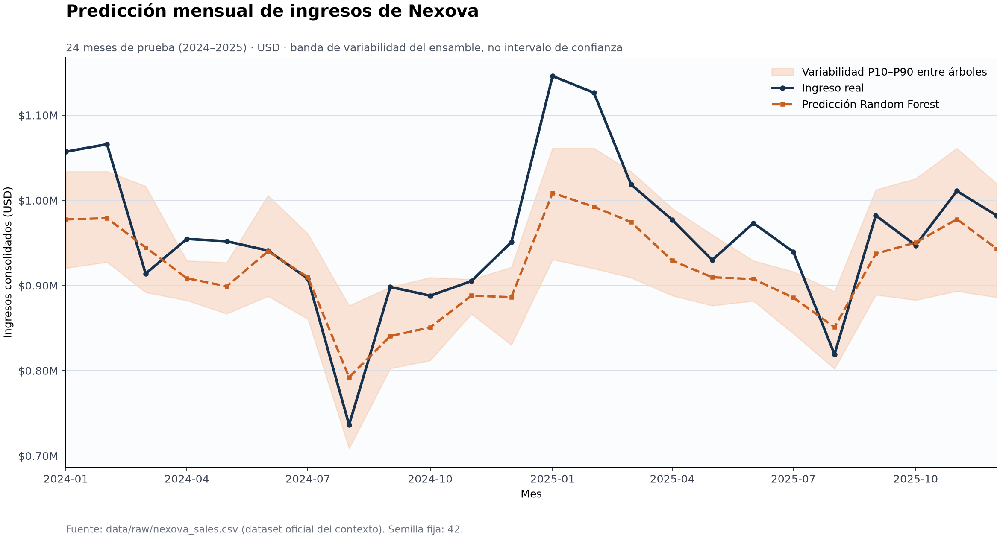

# Nexova Sales Forecast — Technical Summary

## Decision

Random Forest is the selected baseline because Laura and Finance need an
explainable feasibility model on only 96 training observations. It offers
feature importance and a transparent spread across its trees without the extra
tuning surface of XGBoost. The fixed seed makes the experiment reproducible.

## Test design

- Official dataset: 120 monthly consolidated rows, 2016-01 through 2025-12.
- Train: first 8 years (96 rows, 2016-01 through 2023-12).
- Test: final 2 years (24 unseen rows, 2024-01 through 2025-12).
- Features: calendar trend/seasonality, active contracts and average contract
  value. The target `revenue_usd` is never used as an input feature.

## Test metrics

| Metric | Result | Interpretation |
| --- | ---: | --- |
| MSE | 3,595,945,525.65 USD² | Penalizes large misses quadratically. |
| MSE / mean revenue² | 0.39% | Dimensionless normalization of the squared error. |
| RMSE | 59,966.20 USD | Typical error in Finance-readable units. |
| RMSE / mean revenue | 6.25% | Scale-aware error against average test revenue. |
| PSI (revenue, train vs test) | 8.1602 | Cambio material de distribución. |
| Normalized Gini | 0.8939 | Ability to rank weak vs strong months. |
| K2 score | 0.5179 | Course label mapped explicitly to regression R². |
| P10–P90 band coverage | 58.3% | Descriptive tree spread, not a calibrated confidence interval. |

MSE alone is not sufficient: its squared units are difficult to budget against,
it does not reveal ranking quality, and it hides train-to-test distribution
shift. RMSE is therefore the primary Finance metric; Gini answers Laura's need
to distinguish August slowdowns from stronger January/February months, while
PSI warns that the recent period differs from the training population.

For future inference, Finance must provide planned `active_contracts` and
`avg_contract_value_usd`; they are contemporaneous operational inputs, not
values forecast by this model. The calendar-only alternative would avoid that
dependency but would be materially less useful with a 120-row dataset.

`K2 score` is not a standard regression metric in scikit-learn. To keep the
course contract auditable, this implementation reports that label as R² (the
coefficient of determination) and stores the definition next to the value. See
the [official regression metric reference](https://scikit-learn.org/stable/api/sklearn.metrics.html#regression-metrics).

## Visualization

The band is the 10th–90th percentile across individual forest trees. It shows
model variability, but must not be presented as a calibrated probability or
confidence interval.
