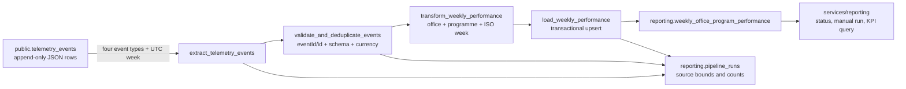

# Weekly Office and Programme Performance Pipeline

Status: Part 1 designed; Part 2 implemented and validated locally
Company: Nexova Solutions  
Business owners: Laura Mendoza (CEO) and Elena Vargas (L&D Manager)  
Cadence: weekly, ready every Monday morning  
Canonical timezone: UTC

## Purpose

Produce the **Weekly Office and Programme Performance Report** for Laura and
Elena every Monday, calculating material cost, delivered kits, shortage
frequency and anomalous cost-variation frequency from Nexova's four mandatory
inventory telemetry signals.

This is a new business-reporting pipeline. It does not replace or modify
`services/telemetry/analysis.py`, `GET /telemetry/report`, or the append-only
`telemetry_events` source.

## Current State

Nexova already captures versioned telemetry envelopes and stores them in
`public.telemetry_events`. Each stored row has the eight-column contract
`id`, `timestamp`, `service`, `event_type`, `level`, `value`, `message` and
`tags`. The original `eventId` is stored as `id`; the business dimensions and
allowlisted event properties are retained in `tags`.

The current eight-column mapping does not persist the envelope's `requestId`.
That does not block the four KPI calculations, but it is a known request-level
lineage gap. The pipeline therefore records `event_id` as its durable v1 link
and accepts a nullable `request_id` in the manifest. A future telemetry-storage
hardening may retain that existing envelope field as metadata inside JSONB
`tags` (not as a new event property or table column); changing the technical
telemetry system is outside Part 2.

The mandatory source events required by this pipeline already exist:

| Event | Business fields used |
| --- | --- |
| `inbound_order_created` | `office`, `programme_id`, `quantity`, `currency`, `unit_cost`, `order_id`, `supplier_id` |
| `outbound_order_created` | `office`, `programme_id`, `quantity`, `currency`, `order_id` |
| `stock_threshold_triggered` | `office`, `programme_id`, `currency`, `threshold`, `available_quantity` |
| `kit_cost_variance_detected` | `office`, `programme_id`, `currency`, `supplier_id`, cost and variance fields |

`unit_cost` is already required by the JSON Schema and frontend allowlist for
`inbound_order_created`, so no telemetry schema extension is needed for this
design. The material cost for an inbound event is
`Decimal(quantity) * Decimal(unit_cost)`.

The existing technical report answers engineering questions about event
volume, error rate, route latency and authentication failures over an arbitrary
UTC window. It does **not** answer the business question: how much each office
invested in a programme, whether its kits were delivered, or whether inventory
and supplier-cost risks occurred during the reporting week. It also has no
weekly business grain or durable business-report table. This is the gap the new
pipeline closes.

## Output Contract

### Business grain and KPI rules

The output grain is exactly one row per:

```text
(office, programme_id, ISO week_start in UTC)
```

`week_start` is the Monday at `00:00:00Z`. The extraction interval is inclusive
at the start and exclusive at the end: `[week_start, week_start + 7 days)`.

| Output field | Calculation |
| --- | --- |
| `total_material_cost` | Sum of `quantity * unit_cost` for `inbound_order_created` |
| `kits_delivered_count` | Count of accepted, unique `outbound_order_created` events |
| `shortage_events_count` | Count of accepted, unique `stock_threshold_triggered` events |
| `cost_variance_events_count` | Count of accepted, unique `kit_cost_variance_detected` events |
| `currency` | `EUR` for Valencia and `USD` for Miami |

The pipeline never converts or totals across currencies. An office/currency
mismatch is rejected into the run's validation evidence rather than silently
corrected.

### Destination table

The durable business result lives only in the dedicated reporting schema:

```sql
create schema if not exists reporting;

create table reporting.weekly_office_program_performance (
  id uuid primary key default gen_random_uuid(),
  office text not null,
  programme_id text not null,
  week_start date not null,
  total_material_cost numeric not null default 0,
  kits_delivered_count integer not null default 0,
  shortage_events_count integer not null default 0,
  cost_variance_events_count integer not null default 0,
  currency text not null,
  computed_at timestamptz not null default now(),
  unique (office, programme_id, week_start),
  check (
    (office = 'valencia' and currency = 'EUR') or
    (office = 'miami' and currency = 'USD')
  )
);
```

The unique business key is the conflict target for every load. No aggregate is
ever written to `public.telemetry_events`.

## Extraction Format and Schedule

### Source and payload

The extractor reads JSON rows from the Supabase/PostgREST representation of
`public.telemetry_events`, selecting only `id`, `timestamp`, `event_type` and
`tags`. It pushes the following filters to PostgreSQL:

- `timestamp >= window_start` and `timestamp < window_end`;
- `event_type IN` the four mandatory event types;
- deterministic ordering by `timestamp`, then `id`;
- pagination by a stable cursor, never by an unbounded full-table download.

The returned JSON becomes a typed Pandas DataFrame. Numeric fields are parsed
with `Decimal` semantics before aggregation; timestamps are converted to
timezone-aware UTC values before the ISO-week key is derived.

### Cadence and freshness

- Scheduled run: Monday at 06:00 UTC for the previous ISO week.
- Expected publication: before 07:00 UTC Monday.
- Manual run: any explicit `week_start` accepted by the reporting API.
- Late-data policy: every scheduled run also recalculates the prior published
  week. A manual backfill can target any older ISO week.
- Source freshness: telemetry is appended continuously; the six-hour grace
  period absorbs routine client buffering before the Monday report.

Local execution after synchronizing the API environment:

```bash
services/api/.venv/bin/python data/pipelines/pipeline.py
services/api/.venv/bin/python data/pipelines/pipeline.py --week-start 2026-08-03 --trigger-source backfill
```

## Data Flow



### Stage responsibilities

1. **Extract** only the required source rows for a bounded UTC week and record
   the source cursor, event-time bounds and extracted count.
2. **Validate and deduplicate** the envelope, business dimensions, office to
   currency mapping and unique `eventId`/stored `id`.
3. **Transform** with vectorized Pandas groupings into the exact destination
   grain and four KPI columns.
4. **Load** all rows for one week in a single database transaction, using an
   upsert on `(office, programme_id, week_start)`.
5. **Publish run evidence** only after the target transaction commits.

## Mutable Sources and Corrections

The v1 telemetry source is append-only, so existing event rows are never
updated. Corrections use an explicit compensating or replacement event with a
new `eventId`; provenance is kept in its allowlisted business identifiers.

If a future enrichment source updates existing programme or order rows, its
extractor must read a monotonically increasing `updated_at` watermark plus the
primary key. The pipeline merges those records by primary key into a snapshot
dimension and advances the watermark only after the reporting load commits.
An update therefore replaces the previous snapshot value instead of creating a
second logical entity. The weekly aggregate is still rebuilt from the complete
target week and upserted, so source corrections cannot accumulate duplicates.

## Idempotency

Idempotency is enforced at three layers:

1. **Ingestion identity:** the producer-generated `eventId` is the canonical
   idempotency key and becomes `telemetry_events.id`. A future ingestion
   hardening can use `ON CONFLICT (id) DO NOTHING` (the PostgREST equivalent is
   `on_conflict=id` plus duplicate-ignore resolution) so a repeated transport
   receives success when the event is already durable. Part 2 leaves the
   existing technical telemetry system unchanged and deduplicates defensively
   during extraction.
2. **Transformation identity:** the validation task keeps one canonical row per
   `id` before aggregation. Its deterministic input ordering makes equal input
   windows produce equal output frames and checksums.
3. **Reporting identity:** the loader upserts on
   `(office, programme_id, week_start)` and assigns all KPI columns from the
   newly recomputed row. It never increments an existing aggregate.

The load for a week executes in one server-side PostgreSQL transaction (exposed
to Supabase as an RPC). The transaction obtains an advisory lock for the ISO
week, upserts the complete batch, deletes obsolete rows for that week that are
not present in the recomputed batch, records the output checksum, and commits.
If the connection fails after 847 of 1,412 candidate rows have been prepared,
the transaction rolls back; a retry recomputes the same week and publishes the
same final set. If the client times out after the database already committed,
the retry performs the same replacements and leaves the result unchanged.

### Late events

A late event is assigned by its occurrence `timestamp`, not its receipt time.
Recalculating that whole ISO week replaces every aggregate for the week. The new
successful run records `invalidates_run_id` pointing to the previous published
run, so the report changes without losing its audit history.

## Observability and Audit Log

### `reporting.pipeline_runs`

Every invocation creates one immutable run record. The latest status endpoint
reads this table; task logs alone are not the audit source of truth.

| Field | Type | Audit reason |
| --- | --- | --- |
| `run_id` | `uuid` | Correlates Prefect, source manifest, API request and load transaction |
| `pipeline_name` | `text` | Separates this pipeline from future reporting jobs |
| `trigger_source` | `text` | Distinguishes `schedule`, `manual` and `backfill` runs |
| `requested_by` | `text null` | Opaque actor ID for an authorized manual run; never email or PII |
| `window_start` | `timestamptz` | Proves the inclusive source boundary |
| `window_end` | `timestamptz` | Proves the exclusive source boundary |
| `started_at` | `timestamptz` | Measures freshness and duration |
| `finished_at` | `timestamptz null` | Distinguishes active, abandoned and completed runs |
| `status` | `text` | `PENDING`, `RUNNING`, `COMPLETED` or `FAILED` |
| `phase` | `text` | Last durable checkpoint: `extract`, `validate`, `transform` or `load` |
| `source_cursor` | `jsonb null` | Persists last `(timestamp, id)` page boundary for diagnosis/recovery |
| `records_extracted` | `integer` | Detects source silence and pagination gaps |
| `records_deduplicated` | `integer` | Quantifies repeat transmissions |
| `records_rejected` | `integer` | Makes schema/currency data-quality loss visible |
| `records_loaded` | `integer` | Reconciles output grain with the target table |
| `source_checksum` | `text null` | Detects changed late input for the same week |
| `output_checksum` | `text null` | Proves deterministic reruns |
| `error_code` | `text null` | Stable operational category without secret-bearing exception text |
| `invalidates_run_id` | `uuid null` | Preserves lineage when late data republishes a week |

Detailed errors remain in restricted Prefect logs and contain no event payload,
credentials or PII. The public status response exposes only the stable error
code and safe metadata.

### Source manifest and lineage

`reporting.pipeline_run_inputs` stores `(run_id, event_id, request_id,
event_timestamp)` for each accepted input. `request_id` is nullable for legacy
rows created before the additive storage mapping described in Current State.
This reconstructs event → run → weekly row without copying arbitrary `tags`.
A compact checksum per output key is also recorded in `pipeline_runs`. Together
they distinguish real activity spikes from a batch that crossed an interval
boundary.

### Silence, loss and duplication signals

- A scheduled Prefect deployment emits a heartbeat even when zero rows exist.
- A missing completed run by 07:00 UTC is an orchestration failure, not zero
  business activity.
- `records_extracted = 0` with a healthy heartbeat is reported as a valid empty
  week but raises a warning when active sessions or reporting offices are nonzero.
- Extracted-event counts are compared with active session counts and the number
  of reporting offices, not only with the previous day, so normal Sunday volume
  is not mistaken for data loss.
- `records_deduplicated`, rejected rows, cursor continuity and per-event-type
  counts generate alerts for duplicates, gaps or a silent event family.

## Recovery and Concurrency

- The durable `phase` and `source_cursor` identify the last completed stage.
  Extraction may resume from the cursor, but transformation and load always
  rebuild the complete ISO week for deterministic output.
- Prefect retries extraction three times with exponential backoff for transient
  network failures. Validation failures do not retry; they are quarantined and
  counted. Load retries are safe because the transaction and upsert are
  idempotent.
- The loader obtains a PostgreSQL advisory lock derived from
  `(pipeline_name, week_start)`. A scheduled and manual run for the same week
  cannot publish concurrently.
- A conflicting manual request returns `409` with the existing `run_id`; a run
  for a different week can proceed.
- A stale `RUNNING` row whose Prefect flow no longer exists becomes `FAILED`
  with `error_code = 'stale_run'` before it can be retried.

### Frontend buffering and transport retry

Buffering business telemetry in the browser is acceptable only as a short,
bounded outbox: encrypted transport, no PII, maximum age and size, and flush on
reconnect. `localStorage` is vulnerable to XSS and multi-tab races, so the
server remains responsible for validation and deduplication.

Every `POST /telemetry/events` retry preserves the original event's `eventId`
and sends it as the item-level idempotency key. `200` means every accepted item
is either newly stored or already present; `422` means correct the payload and
do not retry unchanged; `429` and transient `5xx` mean retry with backoff. A
client timeout is retried with the same IDs, never regenerated ones.

## Prefect Mapping

### Main flow

`build_weekly_office_program_performance(week_start, trigger_source,
requested_by=None)` is the single v1 flow. Its weekly deployment runs Monday at
06:00 UTC. A manual or backfill invocation calls the same flow with an explicit
ISO Monday.

### Tasks

| Prefect task | Responsibility | Retry policy |
| --- | --- | --- |
| `start_pipeline_run` | Acquire the week lock and persist `RUNNING` metadata | No blind retry on lock conflict |
| `extract_telemetry_events` | Page through the four event types and persist cursor/counts | 3 transient retries, exponential backoff |
| `validate_and_deduplicate_events` | Validate schema, IDs, dimensions and currency; create lineage manifest | Deterministic; data errors quarantined |
| `transform_weekly_office_program_performance` | Calculate the four KPI columns with vectorized Pandas operations | One retry for worker failure |
| `load_weekly_office_program_performance` | Transactional weekly upsert/reconciliation and checksum | 3 transient retries |
| `finish_pipeline_run` | Persist `COMPLETED` or safe `FAILED` state and release lock | Must run as finalizer |

Relevant Prefect states are `Pending`, `Running`, `Completed`, `Failed`,
`Retrying` and `Cancelled`. The business report is considered published only
when both the load task and flow are `Completed` and the durable run row agrees.

### Prefect blocks

- `Secret` block `nexova-supabase-url`.
- `Secret` block `nexova-supabase-service-role-key` (server/worker only).
- A database/Supabase credentials block for the transactional reporting RPC.
- A deployment parameter block containing schedule, retry limits and freshness
  threshold; no environment-specific value is committed.

## Application Integration Design

All HTTP handlers live under `services/reporting/`. They authenticate callers,
validate inputs and serialize results; they do not contain ETL logic.

| Endpoint | Behaviour | Function imported from `data/pipelines/` |
| --- | --- | --- |
| `GET /reporting/pipeline-runs/latest` | Latest safe status, counts, window and timestamps | `get_latest_pipeline_run()` |
| `POST /reporting/pipeline-runs` | Authorised manual run; `202` with `run_id`, or `409` for the same-week lock | `start_weekly_office_program_performance_run()` |
| `GET /reporting/weekly-office-program-performance?week_start=YYYY-MM-DD` | All office/programme rows for the requested week; defaults to latest completed week | `get_weekly_office_program_performance()` |

The KPI response uses the exact domain labels and fields:

```json
{
  "week_start": "2026-07-13",
  "entries": [
    {
      "office": "valencia",
      "programme_id": "b2b-sales",
      "total_material_cost": 1240.50,
      "kits_delivered_count": 18,
      "shortage_events_count": 1,
      "cost_variance_events_count": 0,
      "currency": "EUR"
    }
  ]
}
```

## Data-Quality Gates

The load is blocked when any of these conditions is true:

- timestamp is invalid, non-UTC or outside the requested week;
- `event_type` is outside the four-event v1 allowlist;
- `eventId`/stored `id`, `office` or `programme_id` is missing;
- Valencia is paired with a currency other than EUR, or Miami with a currency
  other than USD;
- inbound `quantity` is not a positive integer or `unit_cost` is negative;
- a count or cost aggregate is negative;
- an output key appears more than once after aggregation.

Rejected records are counted and linked to the run by event ID and safe reason
code. Their full payload is never exposed through the reporting API.

## Part 2 Verification

The implementation and its acceptance suite prove:

1. a fixture containing all four event types produces the exact four KPI values;
2. Valencia/EUR and Miami/USD remain separate and are never summed;
3. duplicate event IDs are counted once;
4. inclusive-start/exclusive-end boundaries assign Sunday and Monday correctly;
5. a second run over the same input leaves the target byte-for-byte equivalent
   apart from the permitted `computed_at` publication timestamp;
6. a simulated mid-load failure publishes no partial rows;
7. a late event recalculates the week and links the invalidated run;
8. concurrent same-week invocations yield one publisher and one `409` conflict;
9. zero source rows still produce a completed heartbeat/run with an empty result;
10. the three HTTP endpoints call pipeline functions and contain no duplicated
    transformation logic;
11. `services/telemetry/analysis.py` and `GET /telemetry/report` remain unchanged.

Local evidence on 14/08/2026: **57 backend tests passed**, including six new
pipeline/reporting tests; the exact CLI command completed with seven source
events, two output rows and a Prefect `Completed` state. The second identical
run produced no duplicate business rows, the optional snapshot was forced to
fail without failing its flow, and the authenticated endpoint tests covered
status, manual trigger, KPI response, Monday validation and active-run conflict.
The Next.js production build still produces the existing seven routes.

## Scope Boundaries

Version 1 intentionally excludes currency conversion, forecasting, additional
business KPIs and new event types. It produces only the weekly office/programme
dataset required by Laura and Elena. Part 2 implements the flow, database
objects and HTTP boundary; Part 3 may split stages into subflows and add the
business dashboard without changing this contract.
