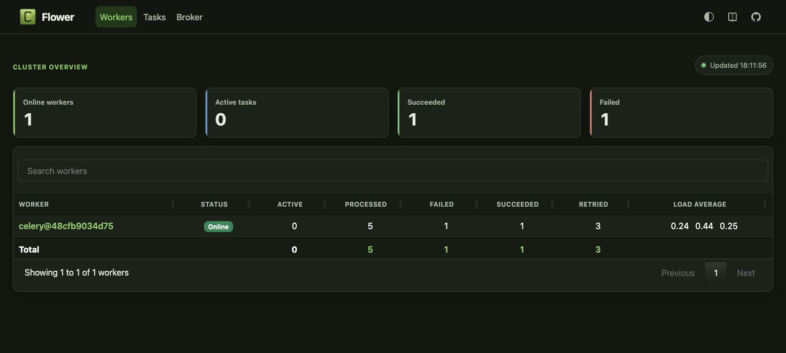

# Redis/Celery async task delivery

The existing weekly reporting pipeline is now executed outside the FastAPI
process. `POST /reporting/pipeline-runs` validates and reserves a run, publishes
only three small identifiers to Redis, and returns HTTP 202 with `task_id`.
`GET /tasks/{task_id}` exposes `pending`, `started`, `success`, or `failure` and
returns a result only after completion.

## Local stack

```bash
cp .env.example .env
docker compose up --build redis backend worker flower
```

- API: `http://localhost:8000`
- Redis: `localhost:6379`, official `redis:7-alpine`, `noeviction`
- Flower: `http://localhost:5555`
- Worker: separate `worker` container

The broker and result backend both use `REDIS_URL`. The worker acknowledges
late, prefetches one task at a time, tracks `STARTED`, and logs `task_id`,
attempt, status, duration and a safe exception class.

## Failure policy

The task makes at most three retries after its initial attempt, with delays of
1, 2 and 4 seconds. After the fourth failed attempt it writes `task_id`, attempt,
safe error class and UTC timestamp to the SQLite dead-letter table configured by
`TASK_DLQ_DB`, then lets Celery retain the final `FAILURE` result.

## Verification

```bash
services/api/.venv/bin/python -m pytest services/api/tests/test_async_tasks.py -q
docker compose config --quiet
```

The test suite covers the sub-200 ms enqueue boundary, lightweight arguments,
status result contract, three-retry cap and durable DLQ record.

## Verified evidence — 17 August 2026

- Complete suite: **64 passed**.
- Real Compose enqueue: **HTTP 202 in 147.16 ms**.
- Real successful task: `records_extracted=7`, `records_loaded=2`.
- Controlled invalid-week probe: attempts 1–4, delays 1/2/4 seconds, final
  `FAILURE`, and a shared SQLite DLQ row with `attempt=4`, `error=ValueError`.
- Flower observed one online worker, one success, one failure and three retries.



Sanitised worker evidence:

```text
task_id=76774bff-5d14-4851-86f1-d48c314f130f attempt=1 status=success duration_ms=...
task_id=dad29305-d7f4-4aeb-b8b8-1362d8f289b3 attempt=3 status=retry error=ValueError countdown_s=4
task_id=dad29305-d7f4-4aeb-b8b8-1362d8f289b3 attempt=4 status=failed error=ValueError
DLQ: task_id=dad29305-d7f4-4aeb-b8b8-1362d8f289b3 attempt=4 error=ValueError
```
